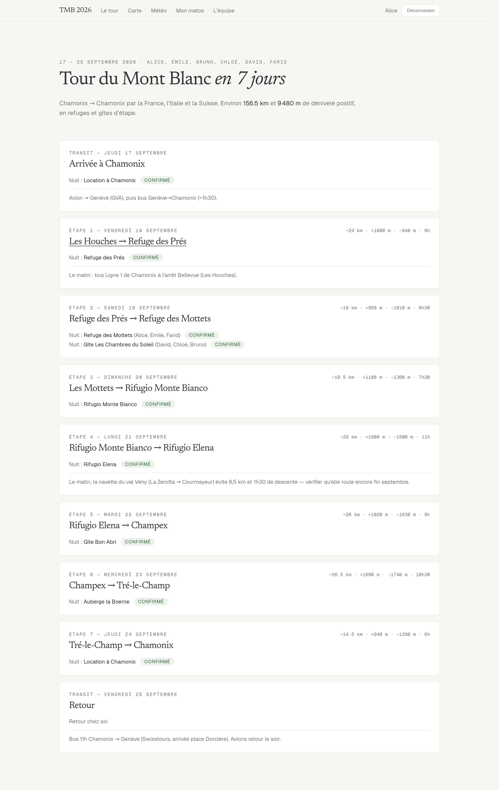
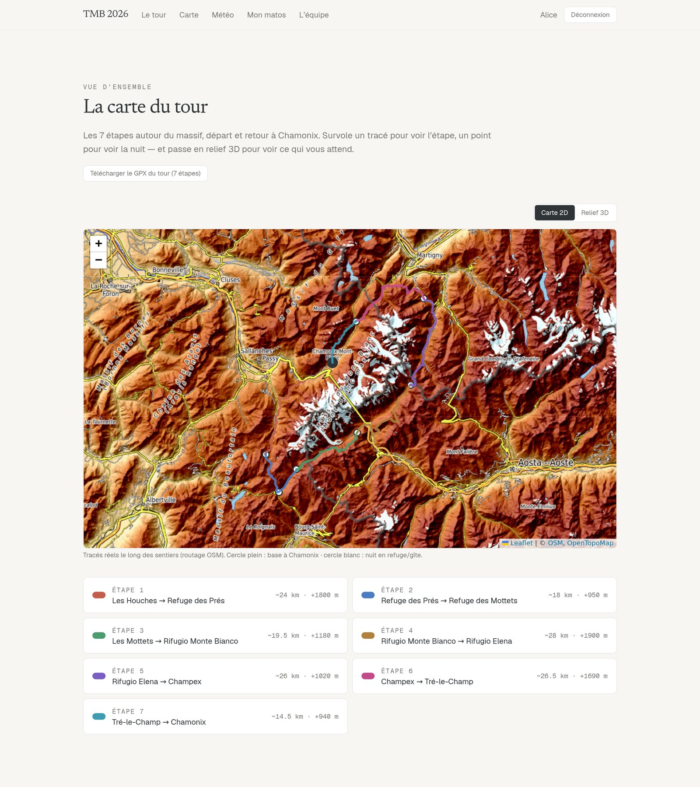
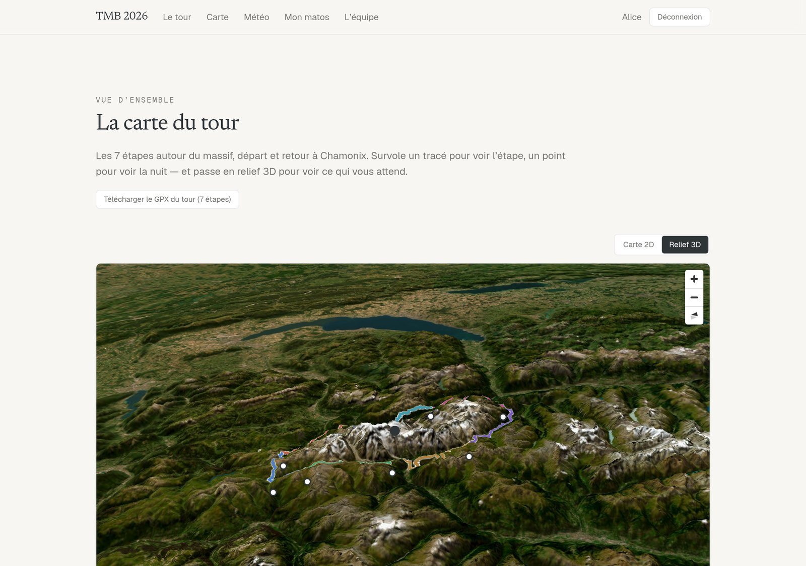
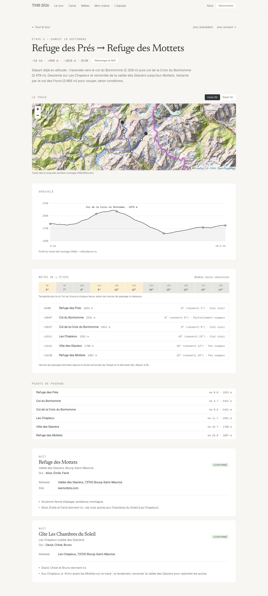
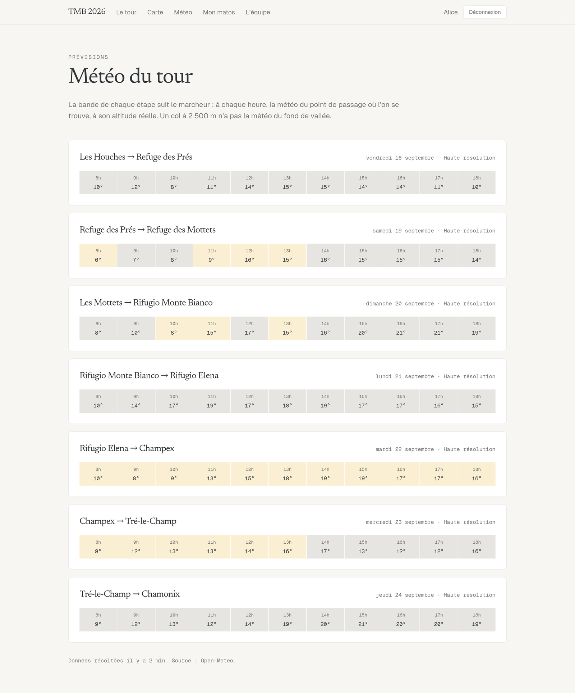
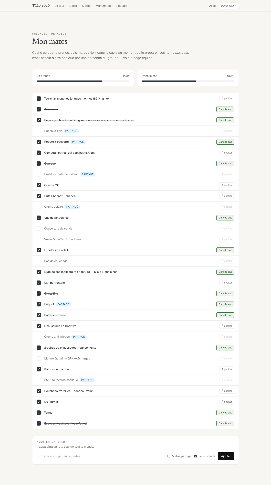
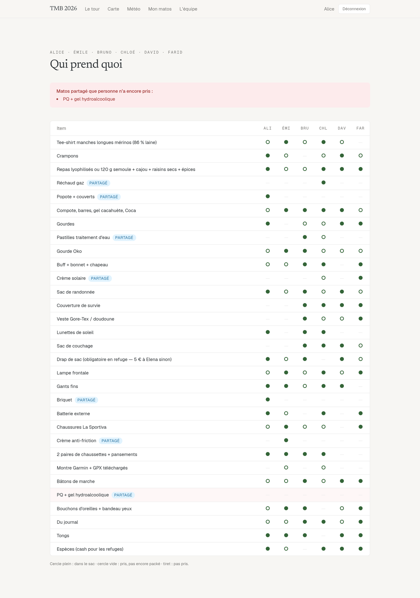
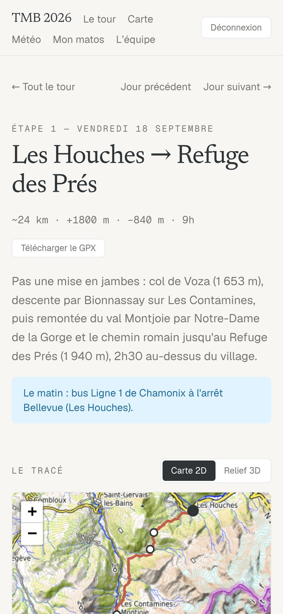

# Tour du Mont Blanc en 7 jours — la webapp du groupe

Une petite webapp auto-hébergée pour préparer et vivre un **Tour du Mont Blanc
entre amis** : les étapes jour par jour sur de vrais tracés de sentier, le
dénivelé, les refuges et leurs consignes, une **carte en relief 3D**, la
**météo à l'altitude de chaque col** et une **checklist de matos partagée**.

On l'a construite pour notre propre TMB (septembre 2026, 6 personnes, 7 étapes,
~156 km et ~9 500 m de D+) et on l'a utilisée tout le long du tour. Le dépôt
contient notre itinéraire réel. Il suffit de le forker et de modifier un seul
fichier pour l'adapter à votre groupe, à vos dates ou même à un autre trek.



---

## Sommaire

- [Ce que fait l'app](#ce-que-fait-lapp)
- [L'itinéraire, étape par étape](#litinéraire-étape-par-étape)
- [Captures d'écran](#captures-décran)
- [Démarrer](#démarrer)
- [Adapter à votre tour](#adapter-à-votre-tour)
- [La météo](#la-météo)
- [Déployer pour le groupe](#déployer-pour-le-groupe)
- [Stack et architecture](#stack-et-architecture)
- [Crédits des données](#crédits-des-données)

---

## Ce que fait l'app

| | |
|---|---|
| 🗺️ **Le tour** | Une carte par jour : date, distance, D+/D−, durée, logement du soir et statut de réservation, conseils de transport. |
| 📍 **Tracés réels** | Chaque étape est routée le long des vrais sentiers (BRouter / OpenStreetMap). Les profils de dénivelé sont calculés à partir de ces tracés, pas d'une ligne droite entre deux cols. |
| ⛰️ **Relief 3D** | Chaque carte a un bouton « Relief 3D » : MapLibre GL, tuiles d'élévation AWS Terrain et imagerie satellite Esri. On voit ce qui nous attend. |
| 📥 **GPX** | Téléchargement du GPX de chaque étape ou du tour complet, pour la montre ou le téléphone. |
| 🌦️ **Météo au bon endroit, à la bonne heure** | Prévisions Open-Meteo pour chaque point de passage *à son altitude réelle*. Une bande horaire suit le marcheur : à 11 h, on voit la météo du col où on sera à 11 h. Alertes automatiques (rafales, isotherme 0 °C, pluie, froid ressenti, visibilité). |
| 🏠 **Refuges** | Adresse, téléphone, site, lien Google Maps et toutes les consignes (drap de sac, cash, horaires de check-in, no-show…). Les nuits où le groupe est réparti entre deux gîtes sont gérées. |
| 🎒 **Mon matos** | Checklist personnelle en deux temps, « je prends » puis « dans le sac », avec barres de progression. Chacun peut ajouter des items. |
| 👥 **L'équipe** | Tableau croisé de qui prend quoi, avec une alerte quand un item **partagé** (réchaud, popote, crème solaire…) n'a encore été pris par personne. |
| 🔐 **Comptes** | Un compte par personne, pré-créé, avec un simple mot de passe. Pas d'inscription ni d'e-mail. |
| 📱 **Mobile d'abord** | Pensée pour être consultée au refuge sur un téléphone. |

---

## L'itinéraire, étape par étape

Sens classique (anti-horaire), départ et arrivée à Chamonix, en passant par la
France, l'Italie et la Suisse. Total : **~156,5 km · +9 480 m · −9 370 m**.

| Jour | Étape | Distance | D+ | D− | Durée | Nuit |
|---|---|---:|---:|---:|---:|---|
| J0 | Arrivée à Chamonix (vol → Genève, bus) | — | — | — | — | Chamonix |
| **1** | Les Houches → Refuge des Prés | 24 km | 1 800 m | 840 m | 9 h | Refuge des Prés (1 940 m) |
| **2** | Refuge des Prés → Refuge des Mottets | 18 km | 950 m | 1 010 m | 6 h 30 | Refuge des Mottets / Les Chapieux |
| **3** | Les Mottets → Rifugio Monte Bianco 🇮🇹 | 19,5 km | 1 180 m | 1 360 m | 7 h 30 | Rifugio Monte Bianco (1 680 m) |
| **4** | Rifugio Monte Bianco → Rifugio Elena | 28 km | 1 900 m | 1 500 m | 11 h | Rifugio Elena (2 062 m) |
| **5** | Rifugio Elena → Champex 🇨🇭 | 26 km | 1 020 m | 1 630 m | 9 h | Gîte Bon Abri |
| **6** | Champex → Tré-le-Champ 🇫🇷 | 26,5 km | 1 690 m | 1 740 m | 10 h 30 | Auberge la Boerne |
| **7** | Tré-le-Champ → Chamonix | 14,5 km | 940 m | 1 290 m | 6 h | Chamonix |
| J8 | Retour (bus Chamonix → Genève) | — | — | — | — | — |

<details>
<summary><strong>Le détail de chaque étape</strong></summary>

### Étape 1 · Les Houches → Refuge des Prés
Ce n'est pas une mise en jambes. On passe le **col de Voza (1 653 m)**, on
descend par Bionnassay sur Les Contamines, puis on remonte le val Montjoie par
Notre-Dame de la Gorge et le chemin romain jusqu'au **Refuge des Prés
(1 940 m)**, 2 h 30 au-dessus du village.
*Accès le matin : bus ligne 1 de Chamonix jusqu'à l'arrêt Bellevue (Les Houches).*

### Étape 2 · Refuge des Prés → Refuge des Mottets
On part déjà en altitude. Traversée vers le **col du Bonhomme (2 329 m)** puis
le **col de la Croix du Bonhomme (2 479 m)**, descente sur Les Chapieux et
remontée de la vallée des Glaciers jusqu'aux Mottets. Selon les conditions, on
peut couper par la variante du col des Fours (2 665 m).
*Ce soir-là, le groupe était réparti entre les Mottets et un gîte aux Chapieux.
L'app gère ce cas (`nights` dans `seed-data.ts`).*

### Étape 3 · Les Mottets → Rifugio Monte Bianco
Montée au **col de la Seigne (2 516 m)** et passage en Italie. On descend le
val Vény par le refuge Elisabetta et le lac Combal, on remonte sur **l'arête du
Mont-Favre (2 435 m)**, puis on passe le col Chécrouit avant une courte descente
jusqu'au Rifugio Monte Bianco.

### Étape 4 · Rifugio Monte Bianco → Rifugio Elena
L'étape reine. On descend sur Courmayeur, on fait la grosse montée au **refuge
Bertone (1 989 m)** et on suit le magnifique **balcon du val Ferret face aux
Grandes Jorasses** jusqu'au refuge Bonatti. Descente sur Arnouvaz et remontée
finale au **Rifugio Elena (2 062 m)**.
*Astuce : la navette du val Vény (La Zerotta → Courmayeur) évite 6,5 km et
1 h 30 de descente. Vérifiez qu'elle circule encore en fin de saison.*

### Étape 5 · Rifugio Elena → Champex
Montée directe au **Grand col Ferret (2 537 m)** et passage en Suisse. Longue
descente du val Ferret suisse par La Fouly, Praz de Fort et Issert, puis
remontée en forêt jusqu'à Champex-Lac.

### Étape 6 · Champex → Tré-le-Champ
La plus longue journée. On passe par l'alpage de **Bovine (1 987 m)**, ou par la
variante de la fenêtre d'Arpette (2 665 m) pour les plus costauds, puis le col
de la Forclaz et Trient. On remonte au **col de Balme (2 191 m)**, on rentre en
France et on descend sur Tré-le-Champ.

### Étape 7 · Tré-le-Champ → Chamonix
Un final en beauté sur le balcon sud : les échelles de l'Aiguillette
d'Argentière, la **Tête aux Vents (2 132 m)** et La Flégère, avec un détour
possible au lac Blanc. Descente sur Chamonix à pied ou en téléphérique.

</details>

> Les distances et dénivelés affichés sont des estimations standard TMB.
> Les tracés et profils de l'app viennent du routage OSM et peuvent différer de
> quelques centaines de mètres.

---

## Captures d'écran

### La carte du tour, en 2D et en relief 3D

| Carte 2D | Relief 3D |
|---|---|
|  |  |

### Une étape : tracé, profil, météo horaire, points de passage et refuges

<p align="center">
  
</p>

### La météo du tour

La bande horaire suit la progression du marcheur. La couleur de chaque case
indique le ciel : jaune pour le soleil, gris pour les nuages, bleu pour la
pluie, rouge pour l'orage.



### Le matos : ma checklist et la vue équipe

| Mon matos | L'équipe |
|---|---|
|  |  |

### Sur mobile, et la connexion

| Mobile | Connexion |
|---|---|
|  |  |

> Les prénoms (Alice, Émile, Bruno…) sont des prénoms d'exemple.

---

## Démarrer

**Prérequis : Node.js 22 ou plus** (voir `.nvmrc`). `better-sqlite3` est un
module natif et plante avec les versions plus anciennes.

```bash
npm install     # copie aussi le worker MapLibre dans public/maplibre/ (postinstall)
npm run dev
```

Ouvrez ensuite http://localhost:3000.

### Comptes

Les comptes sont créés au premier lancement à partir de la liste `USERS` de
`lib/seed-data.ts`. Le mot de passe initial est **`<prénom en minuscules>2026`**,
accents compris : `alice2026`, `émile2026`…

> ⚠️ Ce schéma de mot de passe convient à un groupe d'amis, pas à une app
> publique. Avant de mettre l'app en ligne, changez-le dans `lib/db.ts` et
> définissez `TMB_SECRET` (voir [Déployer](#déployer-pour-le-groupe)).

### Tests

```bash
npm test        # vitest : auth, base, GPX, itinéraire, horaires de passage, météo…
```

---

## Adapter à votre tour

Tout le contenu du tour tient dans **un seul fichier : `lib/seed-data.ts`**.

| Constante | Contenu |
|---|---|
| `USERS` | Les prénoms du groupe, soit un compte par personne. |
| `LODGINGS` | Les logements : nom, adresse, coordonnées, téléphone, site, statut (`confirme` / `a_reserver`) et liste de consignes libres. |
| `DAYS` | Les jours : date, type (`travel` / `hike`), titre, distance, D+/D−, durée, description, **points de passage** (nom, lat, lng, altitude, km cumulé), logement du soir, note de transport. Une nuit répartie sur plusieurs logements se déclare avec `nights: [{ lodgingId, who }]`. |
| `GEAR_ITEMS` | La liste de matos de départ. Mettez `shared: true` pour ce qu'une seule personne doit emporter. |

Après avoir modifié les points de passage, **régénérez les tracés** :

```bash
node scripts/fetch-trails.mjs            # profil BRouter par défaut : hiking-mountain
```

Le script interroge BRouter, trace le chemin à travers vos points de passage et
écrit `public/trails/etape-N.json`, qui sert aux cartes, aux profils, aux GPX et
aux horaires de passage de la météo.

La base SQLite (`data/tmb.db`, créée automatiquement) ne contient que l'état :
les comptes, les coches du matos et le cache météo. **Supprimez-la pour tout
réinitialiser.**

Rien n'est spécifique au Mont Blanc. Avec d'autres points de passage, l'app
marche pour le GR20, le Tour des Écrins ou le Haute Route.

---

## La météo

- **Source** : [Open-Meteo](https://open-meteo.com), gratuit et sans clé d'API.
- **À la bonne altitude** : chaque point de passage est interrogé à son
  altitude réelle. Un col à 2 500 m n'a pas la météo du fond de vallée.
- **À la bonne heure** : `lib/schedule.ts` estime l'heure de passage à chaque
  point à partir du tracé réel, de son dénivelé et de la durée annoncée de
  l'étape (départ à 8 h).
- **Confiance** : chaque étape indique le niveau de confiance selon
  l'échéance : « modèle haute résolution » à court terme, « prévision fiable »
  jusqu'à 5 jours, puis « tendance, à confirmer ». Les alertes lointaines sont
  formulées comme « possibles ».
- **Cache** : les données sont stockées dans SQLite et rafraîchies à la
  lecture quand elles ont plus d'une heure. Aucun cron n'est nécessaire. Pour
  forcer une mise à jour : `node scripts/fetch-weather.mjs`.
- **Alertes** : les seuils sont regroupés dans `THRESHOLDS`, en haut de
  `lib/weather-alerts.ts`.

```ts
export const THRESHOLDS = Object.freeze({
  gustWarn: 60,         // km/h
  gustAlert: 80,        // km/h
  freezingMarginM: 200, // isotherme 0 °C à moins de 200 m au-dessus du point
  rainTotalMm: 5,       // cumul sur l'étape
  rainProbPct: 60,      // … pendant 3 h consécutives
  rainProbHours: 3,
  feelsColdC: -5,
  visibilityM: 500,
});
```

---

## Déployer pour le groupe

Le plus simple est un petit VPS avec Node 22 :

```bash
npm ci
npm run build
TMB_SECRET="une-longue-chaîne-aléatoire" npm start   # port 3000
```

- **`TMB_SECRET`** (obligatoire en production) : sert à signer les cookies de
  session. Sans cette variable, l'app utilise une valeur de développement
  publique.
- Placez un reverse proxy HTTPS devant (Caddy, nginx…).
- La base SQLite vit dans `data/`. Pensez à conserver ce dossier entre les
  déploiements.
- Sur un hébergeur serverless comme Vercel, SQLite en fichier ne persiste pas.
  Il faudrait migrer `lib/db.ts` vers Turso, Supabase ou un équivalent.

---

## Stack et architecture

- **Next.js 16** (App Router, Server Components, Server Actions) · **React 19**
- **Tailwind CSS 4**
- **SQLite** via `better-sqlite3`
- **Leaflet / react-leaflet** pour les cartes 2D, **MapLibre GL** pour le relief 3D
- **Vitest** pour les tests
- Authentification maison : hash `scrypt` et jetons de session signés HMAC (`node:crypto`), sans dépendance

```
app/
  login/, logout/            connexion par prénom + mot de passe
  (protected)/               tout ce qui demande d'être connecté
    page.tsx                 le tour, jour par jour
    jour/[n]/                une étape (+ /gpx)
    carte/                   carte du tour (+ /gpx du tour complet)
    meteo/                   météo de toutes les étapes
    matos/                   ma checklist
    equipe/                  qui prend quoi
components/                  cartes 2D/3D, profil de dénivelé, bande météo, cartes refuge…
lib/
  seed-data.ts               ← LE fichier à modifier : groupe, jours, refuges, matos
  db.ts, sqlite.ts           accès SQLite (comptes, matos)
  auth.ts, session.ts        mots de passe et cookies de session
  gpx.ts, trails.ts          tracés et export GPX
  schedule.ts                heures de passage estimées
  weather-*.ts               récolte, cache et alertes météo
public/trails/               tracés routés (GeoJSON) de chaque étape
scripts/
  fetch-trails.mjs           régénère les tracés via BRouter
  fetch-weather.mjs          force une récolte météo
```

---

## Crédits des données

- Fonds de carte : © [OpenStreetMap](https://www.openstreetmap.org/copyright), [OpenTopoMap](https://opentopomap.org) (CC-BY-SA)
- Routage des sentiers : [BRouter](https://brouter.de)
- Relief 3D : [AWS Terrain Tiles](https://registry.opendata.aws/terrain-tiles/), imagerie satellite © Esri
- Météo : [Open-Meteo](https://open-meteo.com) (CC-BY 4.0)

Ces services sont gratuits et partagés : rafraîchissez les données avec
modération.

## Licence

[MIT](LICENSE). Forkez, adaptez et partez marcher. Bon tour ! 🥾
